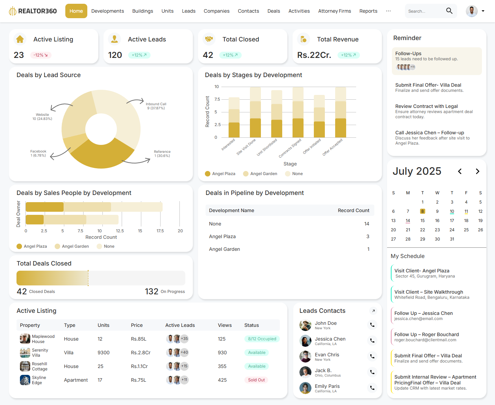
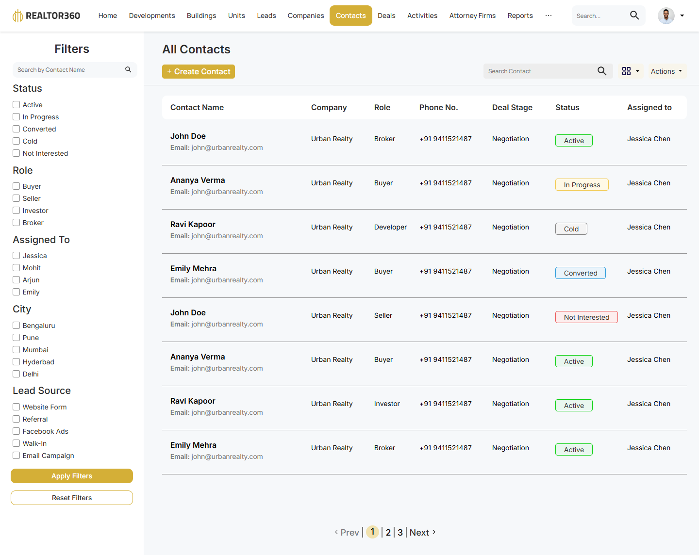
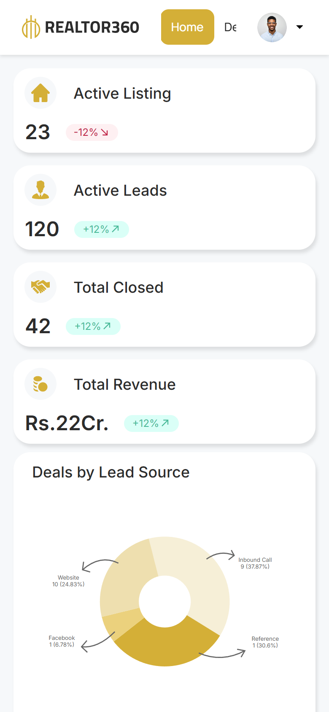

# Realtor360

A pixel-matched TypeScript build of the **Realtor360** real-estate CRM design from Figma. It covers both frames in the prototype: the **Home dashboard** and the **All Contacts** page.



| All Contacts (1440px) | Dashboard (390px) |
| --- | --- |
|  |  |

## How close it is

The build was measured against a lossless 2x render of the Figma prototype, element by element. Each text run, icon, bar and badge was matched as an ink blob in both images and its offset recorded:

| Frame | Elements compared | Within 1px | Within 2px |
| --- | --- | --- | --- |
| Home (1440 × 1182) | 296 | 98.6% | 99.7% |
| All Contacts (1440 × 1144) | 193 | 99.5% | 100% |

The remaining differences are glyph anti-aliasing. Chrome rounds font ascent and descent to whole pixels, while Figma doesn't.

## Stack

- **React 19 + TypeScript + Vite 8**
- **CSS Modules** with design tokens in [`src/styles/global.css`](src/styles/global.css). No UI kit.
- **Hand-written SVG charts** (donut, stacked columns, stacked bars) drawn in the design's own coordinates, so every bar, tick and callout lands where Figma puts it
- **React Router** for Home, Contacts and placeholder routes for the other nav sections
- Self-hosted **Inter** and **Manrope** via Fontsource. The nav and search fields use Manrope 500; everything else uses Inter.

## Running it

```bash
npm install
npm run dev        # http://localhost:5173
npm run build      # type-check + production build
npm run lint       # oxlint
npm run format     # prettier
```

## What works

**Dashboard**
- KPI cards with trend chips
- Lead-source donut with curved callouts, plus the stage and sales-person stacked charts. Each chart has a native tooltip on every segment and a screen-reader summary of its data.
- Deals-closed meter, the pipeline table, the active listings table with lead avatar stacks, and the lead contacts list with `tel:` call buttons
- The calendar moves between months. July 2025 shows the design's highlighted day and the coloured event underlines that tie to *My Schedule*.

**Contacts**
- Live name search in the sidebar, plus a toolbar search across every column
- Status, role, assignee, city and lead-source filters with **Apply** and **Reset**
- Pagination at 8 rows per page. Page 1 is the Figma frame verbatim; pages 2 and 3 hold extra sample contacts so the filters and paging have data to work on.

**Layout**
- At 1440px both pages match the frames. Grid tracks use the design widths as `fr` values, so every column lands on its Figma pixel.
- Below that the grid reflows: the sidebar wraps under the main column (≤1280px), charts stack (≤1100px), then everything goes to one column (≤700px). Wide tables scroll inside their cards rather than the page.

## How it was matched

There was no Dev Mode access, so every value comes from measuring the prototype itself:

1. **Capture.** I rendered each frame with headless Chrome at 2x and `scaling=min-zoom` (100%), then cropped it to the 1440px frame.
2. **Geometry.** Card bounds, gaps, radii and colours were read straight from pixels. Card shadows were fitted to the measured falloff (`2px 4px 4px rgba(0,0,0,.1)`).
3. **Type.** Each text run was template-matched against Inter and Manrope renders at every weight and half-pixel size, which gives family, weight and size per style.
4. **Charts.** I took donut angles and radii from per-colour pixel masks, bar heights from the column extents, and the label rotation (−40°) from a PCA of the label pixels.
5. **Assets.** Photos were cropped at 2x. The logo and KPI icons were *un-blended* from their known background into transparent PNGs.
6. **Diff loop.** The app was re-rendered at 1440px and 2x and each card was diffed against the capture. I fixed offsets until everything sat within a pixel.

A few things in the design are hand-placed rather than systematic, and the build keeps them as drawn. They are commented in the code:

- the Sales chart's tick labels
- the anchors of the rotated stage labels
- the calendar's uneven column centres
- the pagination's horizontal offset

## Project structure

```
src/
  components/      TopNav, Card, AvatarStack, TrendBadge, icons
  features/
    dashboard/     KPI, chart, table, reminder and calendar cards
      charts/      SVG chart components + geometry helpers
    contacts/      FiltersSidebar, StatusBadge, Pagination
  pages/           DashboardPage, ContactsPage, PlaceholderPage
  data/            typed mock data for both pages
  styles/          global tokens and reset
```

## Deploying

The project is a static SPA. `vercel.json` rewrites every path to `index.html`, so client-side routes work on Vercel. On Netlify, use the same build (`npm run build`, publish `dist`).
